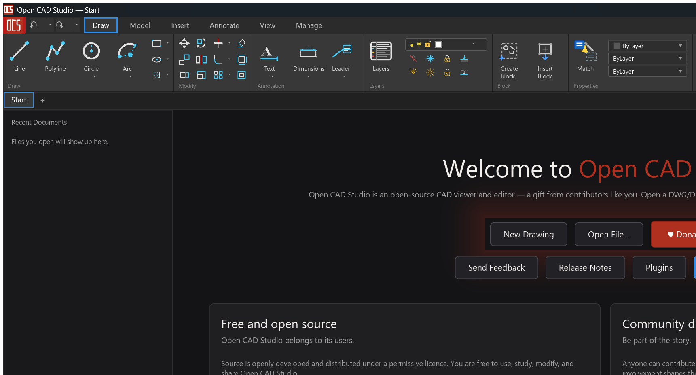
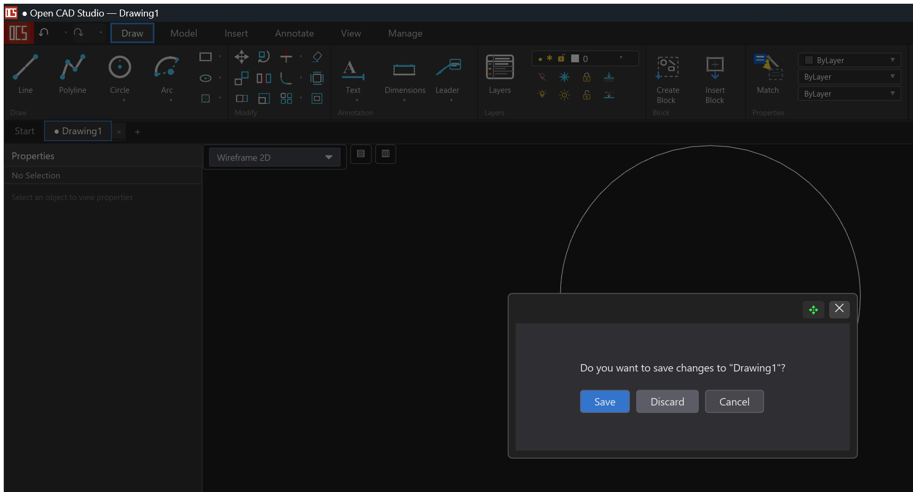

# Open CAD Studio 使用教程

本文面向第一次使用 Open CAD Studio 的用户，介绍从启动、打开图纸、绘制对象到保存文件的常用操作。界面会随着版本持续变化，以下截图基于当前开发版。

## 启动应用

如果你使用发布版，在 Windows 上直接运行 `OpenCADStudio.exe`。如果从源码启动，在项目根目录执行：

```powershell
cargo run
```

启动后会进入欢迎页。左侧是最近打开的文件列表，中间区域提供新建、打开、插件、发布说明和反馈入口。顶部是 Ribbon 功能区，常用命令按 `Draw`、`Model`、`Insert`、`Annotate`、`View`、`Manage` 等页签分组。



## 新建或打开图纸

在启动页点击 `New Drawing` 可以创建空白图纸。点击 `Open File...` 可以打开已有 DWG 或 DXF 文件。打开后的文件会以标签页形式显示，左侧 `Properties` 面板用于查看或编辑当前选中对象的属性。

也可以使用顶部菜单或快捷命令打开文件。常用文件能力包括 DWG/DXF 读写、STL/STEP/OBJ 相关导入导出、PDF 输出、外部参照和块写出。

## 认识主界面

主界面主要分为五个区域：

- 顶部 Ribbon：按任务分组放置绘图、修改、标注、图层、块和属性工具。
- 中央绘图区：显示模型空间或布局空间内容，鼠标用于选择、绘制、平移和缩放。
- 左侧属性面板：选中对象后显示对象属性；未选中对象时显示 `No Selection`。
- 文件标签：在 `Start` 和各个图纸之间切换，也可以通过 `+` 创建新图纸。
- 视图与样式控件：绘图区上方可切换 `Wireframe 2D` 等显示样式。

## 绘制基础图形

进入 `Draw` 页签后，可以直接点击图标创建常用对象：

- `Line`：绘制直线。
- `Polyline`：绘制连续折线。
- `Circle`：绘制圆。
- `Arc`：绘制圆弧。
- `Text`：插入文字。
- `Dimensions`：创建尺寸标注。
- `Leader`：创建引线标注。

基本流程通常是：选择工具，按命令提示指定第一个点，继续指定后续点或参数，最后按 `Enter`、`Esc` 或根据命令提示结束。

## 编辑对象

绘制完成后，可以使用 `Modify` 区域的工具编辑对象。常用命令包括：

- `Move`：移动对象。
- `Copy`：复制对象。
- `Rotate`：旋转对象。
- `Scale`：缩放对象。
- `Mirror`：镜像对象。
- `Trim`：修剪对象。
- `Extend`：延伸对象。
- `Offset`：偏移对象。
- `Fillet`：创建圆角。
- `Explode`：分解块、尺寸、复合线等复合对象。

先选择对象再执行命令，或先执行命令再按提示选择对象，具体取决于命令交互。使用 `Esc` 可以取消当前命令。

## 使用捕捉与精确绘图

Open CAD Studio 支持端点、中点、圆心、象限点、交点、垂足、切点、最近点、插入点等对象捕捉。启用对象捕捉后，鼠标靠近可捕捉位置时会自动吸附到精确点位。

常用精确绘图能力包括：

- `OSNAP`：对象捕捉。
- `OTRACK` / `F11`：对象捕捉追踪。
- `DYNMODE` / `F12`：动态输入。
- 极轴追踪：按角度增量辅助绘图。
- 命令历史：使用上下方向键切换历史命令。

## 管理图层和属性

Ribbon 中的 `Layers` 区域用于管理图层。你可以创建、锁定、冻结、关闭或切换当前图层。右侧属性下拉框可以快速设置对象颜色、线型和线宽，例如 `ByLayer` 表示对象继承所属图层的属性。

典型工作流是先设置当前图层，再绘制对象。这样后续可以按图层批量控制显示、打印和属性。

## 标注、文字和表格

`Annotate` 页签集中放置文字和标注能力。常用功能包括：

- `TEXT` / `MTEXT`：创建单行或多行文字。
- `DIMLINEAR`、`DIMALIGNED`、`DIMANGULAR`、`DIMRADIUS`、`DIMDIAMETER`：创建不同类型尺寸。
- `DIMSTYLE`：管理尺寸样式。
- `MLEADER` / `MLEADERSTYLE`：创建和管理多重引线。
- `TABLE` / `TABLESTYLE`：创建表格和表格样式。

创建标注前建议确认当前图层、文字样式和尺寸样式，避免后续逐个修改。

## 切换视图和显示样式

绘图区上方的显示样式下拉框可以切换线框、着色等显示模式。`View` 页签提供缩放、视图方向、视口和布局相关工具。

常见操作包括：

- 鼠标滚轮缩放视图。
- 使用平移工具移动当前视图。
- 使用 ViewCube 切换顶视图、前视图、等轴测视图等方向。
- 在布局空间中创建或编辑视口。

## 保存和关闭图纸

图纸有未保存改动时，关闭文件或退出应用会出现保存提示。选择 `Save` 保存改动，选择 `Discard` 放弃改动，选择 `Cancel` 返回继续编辑。



建议在长时间绘图时定期保存。对重要文件，保存前可以另存副本，避免覆盖原始图纸。

## 使用插件

启动页和 Ribbon 中提供 `Plugins` / 插件管理入口。当前版本支持外部插件包发现、启用/禁用、安装、卸载和升级。插件通常放在项目或应用识别的插件目录中，并通过插件管理器加载。

如果插件没有出现，先确认插件包结构和清单文件是否正确，再重新打开插件管理器刷新状态。

## 常见问题

如果应用无法启动，先在项目根目录运行：

```powershell
cargo check
```

如果 `cargo check` 通过但 `cargo run` 失败，优先查看终端中的错误信息。当前开发版编译时可能会出现 warnings；warnings 不一定阻止运行，但应在发布前清理。

如果打开文件后显示异常，先确认文件格式和版本。项目支持 DWG/DXF R13 到 R2018；包含外部参照、特殊字体、复杂线型或大型 3D 实体的文件，首次打开和渲染可能需要更长时间。

如果操作过程中界面看起来没有响应，先按 `Esc` 取消当前命令，再尝试切换工具或重新选择对象。
