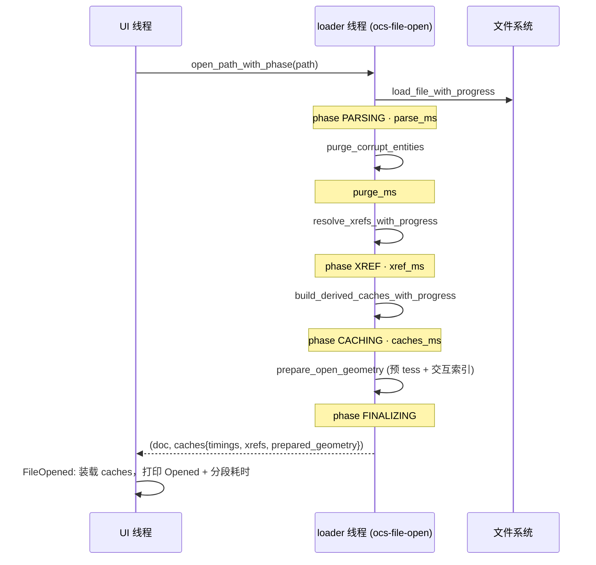

# 开发方案：开档性能基线（步骤 1/3/4 已由上游实现）

> 目标 slug：`perf-open-baseline`
> 仓库：`OpenCADStudio`（Rust + iced 0.14 + acadrust）
> 关联 facts：[`facts.md`](./facts.md)
> **2026-07-26 复核**：本方案写于上游那 99 个提交合并之前。步骤 1、3、4 上游已各自实现，
> 步骤 0、2、5 仍待办。原先依据的 `ROADMAP.md` 已被上游删除（`99f1a267`），下文不再引用其章节号。

---

## 1. 背景与现状

方案最初提出时，开档路径存在四个可验证问题。现在的状态是：

| 原问题 | 现状 | 证据 |
|--------|------|------|
| 二次全量 `purge_corrupt_entities` | **已消除**，全程只 purge 一次 | `src/io/mod.rs:136` 是唯一调用点 |
| XREF 在 UI 线程解析 | **已后台化**，且有独立进度阶段 | `src/io/mod.rs:155`、`app/mod.rs:181`、`open_progress.rs:24` |
| caches 在 xref **之前**构建 | **顺序已修正**为 purge → xref → caches | `src/io/mod.rs:136 / 155 / 175` |
| 无分段耗时日志 | **已有**，开档后打印四段 + total | `src/app/update/file.rs:531` |

因此本方案剩下的价值在于「量」而不是「改」：把实测数据补上，再决定要不要做更细的剖析。

---

## 2. 当前实际数据流

---

## 3. 分步实施

### 步骤 0 — 基准样例与记录 ✅ **已完成（2026-07-26）**

结果见 [`benchmarks.md`](./benchmarks.md)。两条待跟进的结论：
R2010+ 的 DWG 解析比 R2007 及更早慢约 20 倍（同图 11ms → 262ms）；
`total` 中有 320–350ms 落在没有计数器的 `prepare_open_geometry` 上。

**采集方式（可复现）**：~~分段耗时只打印在应用内命令行浮层（不写 stdout），且历史行 3 秒后淡出。
做法是 `--new-instance <file>` 冷启动、最大化窗口、对底部浮层连拍截屏，再抄录数字。~~
**2026-07-26 起改为 `examples/open_bench.rs`**：在进程内按 loader 线程的顺序重放
`load_file → purge → xref → build_derived_caches → prepare_open_geometry` 并打到 stdout，
`OCS_BENCH_COLD=1` 可跳过启动预热。两种口径已交叉验证一致（`benchmarks.md` 第七轮）。

**遗留缺口**：本机没有 5–20MB 量级图纸，也没有含 XREF 的样例，因此 `xref` 列全为 0，
purge 也全是 0ms——去掉二次 purge 与 XREF 后台化的收益**还没有数据支撑**，拿到真实大图后需补测。

---

### 步骤 1 — 开档计时结构体 + 命令行摘要 ✅ **上游已实现**

- `scene::OpenTimings { parse_ms, purge_ms, caches_ms, xref_ms }`（`src/scene/mod.rs:408`），
  由 `open_path_with_phase` 在 loader 线程填充（`src/io/mod.rs:176`）。
- `FileOpened` 打印 `Opened "x.dwg" — N entities` 与
  `  parse Xms · purge Yms · caches Zms · xref Wms · total Tms`（`src/app/update/file.rs:441 / 531`）。

**与原设计的差异**：没有 `first_frame` 字段。`total` 是 UI 侧从点击 Open 到 `FileOpened` 处理完的
wall time，不含首帧渲染。若之后要精确的首帧数字，需另加计时点——但由于
`prepare_open_geometry` 已把整图 tess 前移到 loader 线程，首帧本身的成本已经大幅下降。

**遗留小问题**：`file.rs:524–527` 的注释仍写着 xref 是 "the UI-thread xref resolve"，与代码不符，可顺手修掉。

---

### 步骤 2 — puffin span 基础设施 ▶ **待办（可选）**

`Cargo.toml` 目前没有 puffin/puffin_http，也没有 `profile` feature。若步骤 0 的数据显示某一阶段
（多半是 parse 或 caches）占大头，再按下表接入：

| Span | 位置 |
|------|------|
| `open/parse` | `load_file_with_progress` |
| `open/purge` | `purge_corrupt_entities` |
| `open/xref` | `resolve_xrefs_with_progress` |
| `open/caches` | `build_derived_caches_with_progress` |
| `open/prepare` | `prepare_open_geometry` |

**验证**：`cargo build --release --features profile --bin OpenCADStudio` 通过；默认 release 无 puffin 开销。

---

### 步骤 3 — 去掉 UI 二次 purge ✅ **上游已实现**

`purge_corrupt_entities` 在整条开档路径上只有 `src/io/mod.rs:136` 一个调用点；
xref 合并产生的 corrupt 实体单独计入 `caches.xref_dropped`，在 `file.rs:448` 以独立 warning 打印。

---

### 步骤 4 — XREF 移入后台线程 + 新 phase ✅ **上游已实现**

- `OPEN_PHASE_XREF = 2`（`src/app/mod.rs:181`），进度标签 `"Loading references…"`（`open_progress.rs:24`）。
- loader 线程内 `resolve_xrefs_with_progress` 带 completed/total 回调驱动进度条（`io/mod.rs:140–163`）。
- caches 在 xref 之后构建，顺序正确。
- `FileOpened` 只消费 `caches.xrefs` 打 Loaded / Not found / Unloaded 日志（`file.rs:454–471`）。

---

### 步骤 5 — 收尾与文档 ▶ **部分待办**

| 动作 | 状态 |
|------|------|
| 更新 ROADMAP 勾选 | 已无意义，`ROADMAP.md` 被上游删除 |
| 记录 benchmark 基线 | ✅ 已完成，见 `benchmarks.md` |
| 修 `file.rs` 过时注释 | ✅ 已修（xref 不再是 UI 线程） |
| README 补 profile 构建说明 | 仅当步骤 2 落地后才需要 |

---

## 4. 剩余改动的文件清单

| 文件 | 用途 |
|------|------|
| `src/scene/mod.rs`（`OpenTimings`）、`src/io/mod.rs`、`src/app/update/file.rs` | 加 `prepare_ms` 计数并打进摘要行 |
| `Cargo.toml`、`src/io/mod.rs`、`src/scene/mod.rs` | 步骤 2（可选，埋 puffin span） |
| `README.md` | 仅当步骤 2 落地 |

**刻意不碰**：`app/commands/` 分发、`scene/pipeline/*` 渲染路径、acadrust fork。

---

## 5. 风险与对策

| 风险 | 对策 |
|------|------|
| 样例不够大，基准代表性弱 | `benchmarks.md` 显式标注覆盖缺口；拿到真实大图后补测 |
| debug/release 数字混记 | 每行强制记录构建 profile |
| ~~分段耗时只在 UI 面板，采集靠人工~~ | 已解决：`examples/open_bench.rs` 无界面重放同一条流程并打 stdout |
| puffin 增加 release 体积 | 严格 optional feature，默认不启用 |

---

## 6. 立即执行的下一步（按基线数据重排）

1. ✅ **给 `prepare_open_geometry` 加计时** —— 已完成。摘要行现在是
   `parse · purge · xref · caches · prepare · total`，未覆盖差额从 320–350ms 降到 5–12ms。
2. ✅ **拆解 `prepare_open_geometry` 内部** —— 已完成。全部开销在首次线框 tessellation
   （`model_tile_wires_arc`），交互索引只要 0–3ms。
3. ✅ **消掉首次开档的一次性预热** —— 已完成。`main` 里加了 `scene::text::warm_up_fonts()`，
   后台线程预加载 LFF（78ms）/ 系统字体库（20ms）/ cosmic-text（21ms）。首次开档 346ms → 226ms。
4. ✅ **查 R2010+ 解码慢的原因** —— 已定位，且与版本无关：是 `acadrust` 的 R2010+
   ACAD_TABLE 内容解析器走偏，一条表格记录吃掉 283ms，还把 7×3 的表读成 9 个单元格。
5. **修 acadrust 的 R2010+ 表格解析** —— 根因已定位、修复已实现并验证，**只差落地**。
   根因：`read_cad_value`（`object_reader/entities.rs:2424`）丢了 ACadSharp/ODA 对 R2007+ 值体的
   `IsEmpty`（`Flags & 1`）门，空值被过读，表 `0x528` 第 7 格之后位流就偏了，第 8 格读出
   `ndata=100000`（被 `safe_count` 截断）并空转 283ms。
   修复 + 独立的 `read_bounded_count()` 兑底，实测三个 R2010+ 样例全部 9 格 → 21 格、
   ~265ms → 6–7ms，旧版本路径零变化。
   报告（含根因、补丁、验证矩阵）：[`acadrust-r2010-table-bug.md`](./acadrust-r2010-table-bug.md)。
   已推到 fork `happyrust/acadifc` 的 `fix/r2010-table-isempty-gate`，`[patch]` 指向 rev `c175c52`，
   修复已在 OCS 生效。**剩余动作**：给上游提 issue/PR，合入后把 `[patch]` 指回 OpenAEC-Foundation。
6. **按优先级处理正确性普查的其余分歧**（[`acadrust-version-path-diff.md`](./acadrust-version-path-diff.md)）：
   表格单元格内容是**唯一确认的缺陷**；其次 `wireframe_isolines` 读出负数、
   MultiLeader 附着点（14 个实体、一个字段）、多行属性字段——这三条都还没定性。
   EED（23 个实体）、Spline 存储形式、Text 的 `"0 @ 1"` 图层三条经核实都不是缺陷。
   注意：普查工具只能报「不一致」，每条都要 dump 两边负载再定性——这一轮四条候选里三条是误报。
   差分探针可 20 秒重建、3 秒增量，改完 reader 直接再跑一遍就是回归测试。
7. 文字 tessellation 本身（每张新图 165–200ms）——建议另起目标包，本包不做。
7. 拿到 5–20MB 真实图纸与含 XREF 的样例后补测——当前 purge/xref 两列全是 0，
   上游那两项优化的收益还没有任何数据支撑。
